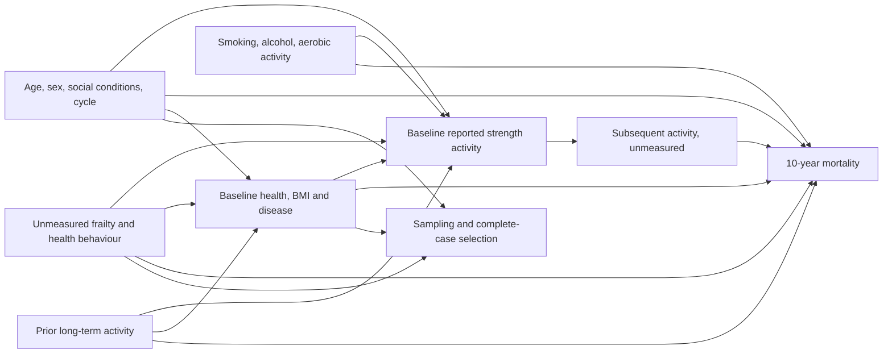

# Working causal diagram and covariate decisions

This is a qualitative causal hypothesis, not an empirically proven DAG or sufficient adjustment-set claim. A is the 30-day baseline exposure; Y is subsequent mortality; H is past activity; U includes latent frailty, functional capacity, access to care, diet and health consciousness; S is survey/response selection.

| Variable | Timing and confounding rationale | Prior-activity mediator / reverse-causation concern | Decision |
|---|---|---|---|
| Age | Predates exposure window; activity and mortality vary strongly with age | No; age top-coded at 85 | Include 4-df spline |
| Sex | Baseline demographic variable associated with activity and mortality | No | Include factor |
| Race/ethnicity | Baseline social classification; structural access, exposures and health inequities | Not biological causal essence; no direct mediation claim | Include five released categories |
| Education | Mostly established before baseline; resources and health knowledge | Some overlap with young-adult timing | Include five categories |
| Income/poverty ratio | Baseline socioeconomic position; activity access and health | Illness may reduce income; can follow prior health/activity | Include 3-df spline; disclose ambiguity |
| Smoking | Baseline behaviour, activity clustering and mortality risk | Can change after illness | Include never/former/current |
| Alcohol | Baseline history and past-year behaviour | Illness-related cessation; residual dose confounding | Include three interpretable groups |
| BMI | MEC measurement near exposure; capacity and mortality correlate | Could mediate past activity; disease-related weight loss | Include 3-df spline for baseline association; no total lifetime-activity claim |
| Aerobic activity | Same recall window, co-occurring health behaviour | Temporal order to strength activity unknown; may co-change | Include four categories, acknowledge weak volume measurement |
| Self-rated health | Baseline general health and ability to exercise | Frailty proxy; may reflect prior exercise | Include five categories |
| Diabetes | Ever diagnosed before interview, except gestational; disease may affect exercise | Prior-activity mediator and illness proxy | Include no/borderline/yes |
| Hypertension | Ever told by professional | Same concern; incomplete diagnosis sensitivity | Include no/yes |
| Major CVD | Any of five prior diagnosed conditions | Strong reverse-causation proxy; prior-activity mediator | Include no/yes; disease-exclusion sensitivity |
| Cancer | Ever prior diagnosis | Same concern; severity and recency unavailable | Include no/yes; disease-exclusion sensitivity |
| Cycle | Calendar period fixed at enrollment; trends in activity, treatment and selection | No | Include four cycles |

No measured variable's significance determines selection. Cross-sectional baseline data cannot establish every temporal relation or eliminate U. Conditioning on complete response S may introduce selection bias; original MEC weights do not correct item nonresponse.
