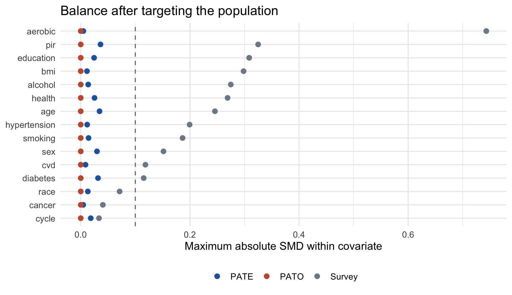
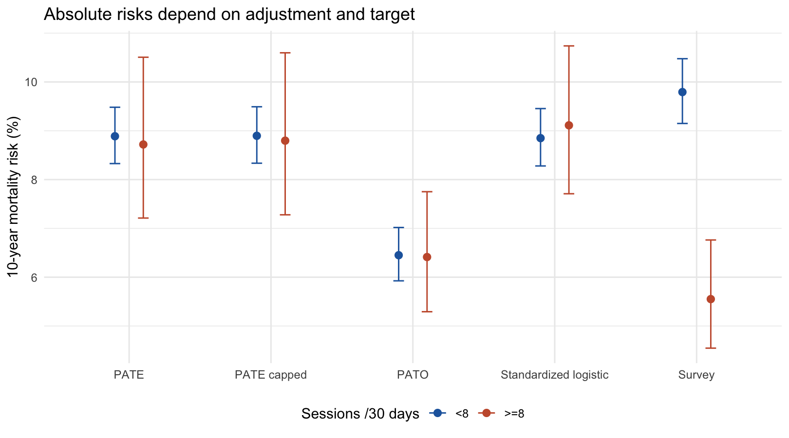
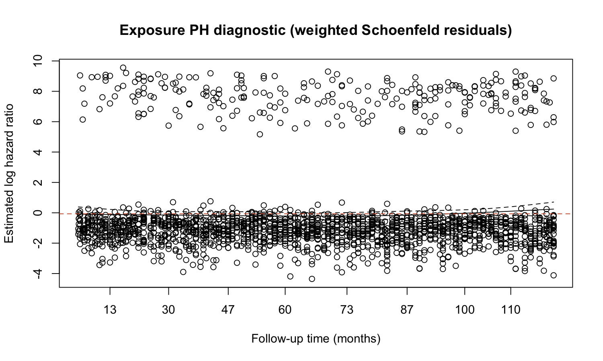

Estimands Matter

A Survey-Weighted Reanalysis of Muscle-Strengthening Activity and 10-Year Mortality in NHANES 1999-2006

Comparing population-average and overlap-population estimates

Independent research report | Design frozen 23 September 2026 (Toronto time)
Public NHANES data linked through 2019 | Not submitted or externally peer-reviewed

## Abstract

Objective. To examine how a change in target population affects adjusted associations between baseline muscle-strengthening activity and ten-year mortality. Methods. We analyzed 15,091 complete-case adults aged at least 20 from four NHANES cycles. Exposure was at least 8 versus 0-7 self-reported sessions in 30 days. Survey-weighted propensity scores generated population-average (PATE) and overlap-population (PATO) composite weights. Stratified delete-one-PSU jackknife inference re-estimated propensity scores in all 117 replicates. Results. There were 1,980 deaths by 120 months. PATE mortality risks were 8.72% versus 8.89%, giving a risk difference of -0.17 (-1.72, 1.38) percentage points and risk ratio 0.98 (0.82, 1.17). PATO risks were 6.41% versus 6.45%, with risk difference -0.04 (-1.06, 0.98) points and risk ratio 0.99 (0.85, 1.17). All intervals are 95% confidence intervals. Conclusions. Both adjusted contrasts were near the null but imprecise. Changing the target materially changed participant composition and absolute risks; it did not create compelling evidence of a different relative association. Baseline reports, complete-case selection and unmeasured confounding preclude an established sustained-training causal effect.

## Why this reanalysis

Strength activity and mortality in these NHANES cycles have already been studied. Booker and colleagues used the same 2019 linkage but derived activity-specific resistance-training frequency and volume; Boyer and colleagues and Zhao and colleagues provide directly related precedents [1-3]. The contribution here is transparent comparison of estimands and uncertainty, rather than novelty of the medical question.

A sampling weight describes how a participant contributes to a survey population. A propensity weight changes comparability and, for overlap weighting, the target population itself [4-6]. A small hazard-ratio coefficient does not establish a population risk difference, and a precisely balanced overlap population is not the entire adult population. We therefore fixed the design before inspecting study mortality outcomes and made ten-year marginal risks the primary endpoints.

---

# 1 | Design, target and estimation

| Component | Frozen specification |
| --- | --- |
| Eligibility | Age >=20; eligible linkage; interpretable strength frequency; positive MEC weight; complete covariates. Reported inability excluded. |
| Time zero / follow-up | MEC examination to 120 months. All surviving analytic participants had at least 154 months of recorded follow-up through 2019. |
| Exposure | PAD440/PAD460: >=8 versus 0-7 sessions in 30 days. A sessions-based approximation to twice-weekly guidance, not measured adherence to all guideline components. |
| Outcome / contrast | All-cause death by month 120 inclusive. Marginal risk difference and risk ratio; conditional Cox HR as benchmark. |
| Interpretation | Adjusted baseline association within a restricted response domain. An ideal sustained-strategy trial cannot be emulated with one baseline report. |

## Covariates and missingness

The outcome-blinded model included age, sex, race/ethnicity, education, income/poverty ratio, smoking, alcohol, BMI, broad aerobic activity, self-rated health, diabetes, hypertension, major cardiovascular disease, cancer and cycle. Natural splines used 4 df for age and 3 each for BMI and poverty ratio. Realized knots were frozen. Other variables were categorical. Alcohol distinguished lifetime <12 drinks, no past-year drinking and past-year drinking; aerobic activity distinguished neither, moderate only, vigorous only and both. These coarse measures leave residual confounding.

The working DAG recognizes that baseline disease, health and BMI can affect recent exercise and mortality, while also reflecting earlier activity. Their adjustment therefore supports a baseline association, not a total effect of lifetime exercise. Complete-case analysis was selected after a missingness audit; no missing categories or univariate significance screening were used. The PATE target is explicitly the survey-weighted complete-response domain, which may differ from adults excluded for missing information.

## Weights and uncertainty

MEC8YR equaled WTMEC4YR/2 for 1999-2002 and WTMEC2YR/4 for 2003-2006. Original masked strata and nested PSUs were retained: 58 strata, 117 PSUs and 59 design degrees of freedom. Let d be MEC8YR and e the survey-logistic propensity score. PATE composite weights were d/e for exposed and d/(1-e) for unexposed participants. PATO weights were d(1-e) and de. Separate-arm weighted means estimated risks; PATO targets a covariate distribution tilted by e(1-e). [4-7]

Primary inference used stratified JKn replicates generated before domain restriction, refitting PS coefficients in each replicate with the fixed basis. Intervals used t(59), logit risks, direct risk differences and log risk ratios. Conventional survey-logistic standardization refit both its outcome model and averaging distribution in replicates. Fixed-PS Taylor estimates were a comparator. These methods propagate sampling and PS coefficient uncertainty, not model-choice, nonresponse or linkage uncertainty. [6-7]

The original outcome-blinded design freeze covered the DAG, covariate dictionary, missing-data plan, diagnostics and sensitivity rules. This public edition preserves those scientific choices and records its current file hashes separately; see DESIGN_FREEZE.md. The historical freeze was not prospective public registration or external approval. Target-trial components guide the question, but the sustained-exposure gap remains. [8]

---

# 2 | Analytic sample and selection

| Selection step | Retained n | Excluded at step |
| --- | --- | --- |
| All NHANES participants | 41,474 | -- |
| Adults age 20+ | 20,311 | 21,163 |
| Mortality linkage eligible | 20,290 | 21 |
| Interpretable strength exposure | 19,420 | 870 |
| Positive MEC weight | 18,264 | 1,156 |
| Covariate-complete analytic sample | 15,091 | 3,173 |

Of 870 exposure exclusions after linkage, 851 reported inability to perform strength activity; the other 19 had unavailable or uninterpretable responses. All complete cases had valid 120-month outcomes, so no further outcome exclusions occurred. Excluding inability restricts the population and should not be mistaken for a nationally unrestricted contrast.

## Table 1. Survey-weighted baseline characteristics

| Characteristic | All | <8 sessions | >=8 sessions |
| --- | --- | --- | --- |
| Unweighted n | 15,091 | 12,265 | 2,826 |
| Deaths by 120 months, n | 1,980 | 1,732 | 248 |
| Age, mean years | 45.7 | 46.6 | 42.6 |
| Female, % | 51.2 | 52.8 | 45.3 |
| Non-Hispanic White, % | 73.4 | 72.7 | 75.8 |
| College graduate, % | 25.9 | 22.9 | 36.9 |
| Income/poverty ratio, mean | 3.1 | 3.0 | 3.5 |
| BMI, mean kg/m 2 | 28.2 | 28.6 | 26.9 |
| Current smoking, % | 24.4 | 26.0 | 18.3 |
| Past-year drinking, % | 71.5 | 69.0 | 80.8 |
| Both aerobic intensities, % | 25.0 | 17.9 | 51.1 |
| Poor self-rated health, % | 2.7 | 3.2 | 1.0 |
| Diagnosed diabetes, % | 6.5 | 7.1 | 4.4 |
| Major CVD, % | 8.0 | 8.6 | 5.6 |
| Cancer history, % | 7.9 | 8.2 | 7.1 |

Weighted exposure prevalence was 21.37%. The complete-case MEC weight sum was 167.5 million, a response-domain total, not a newly calibrated estimate of all adults. Full category-level denominators appear in the supplemental CSV tables.

Complete cases retained 82.63% of the 18,264 otherwise eligible examined adults. Missingness was largest for alcohol (8.01%), poverty ratio (7.63%) and BMI(2.58%). Excluded respondents had lower observed mean poverty ratio (2.57 versus 3.07), more poor health (3.75% versus 2.69%) and lower exposure prevalence (18.77% versus 21.37%). Original survey weights do not resolve this item-nonresponse selection.

---

# 3 | Balance, overlap and target population

Figure 1. Maximum absolute SMD within each covariate (including spline/dummy columns). The full basis-level diagnostic is retained separately; .10 was the prespecified descriptive threshold.

The largest absolute SMD fell from 0.743 under survey weights alone to 0.036 under PATE weights and approximately zero under PATO weights. The latter is expected for included model columns from the weighted logistic score equations; exact mean balance is not evidence that unmeasured confounding is absent. The unweighted-PS comparator had maxima 0.051 and 0.052 and was not selected.

| Weighting | ESS: <8 | ESS: >=8 | Max within-arm weight / mean |
| --- | --- | --- | --- |
| Survey | 7,774 | 2,013 | 4.8 |
| PATE | 7,203 | 1,194 | 20.9 |
| PATO | 4,442 | 1,957 | 14.0 |

Observed propensity scores ranged from 0.014 to 0.717. The empirical common range was 0.022-0.702; 69 participants (0.33% of survey weight) lay outside it. No hard support trimming was applied. The maximum exposed PATE multiplier was 45.42. Bounded overlap multipliers avoid inverse-propensity explosions, but composite weights still inherit survey-weight variability. ESS describes dispersion, not independent sample size or guaranteed precision.

## Who receives more representation under PATO?

| Characteristic | Original domain | PATE composite | PATO composite |
| --- | --- | --- | --- |
| Mean age | 45.7 | 45.9 | 43.7 |
| College graduate, % | 25.9 | 25.9 | 33.5 |
| Both aerobic intensities, % | 25.0 | 25.2 | 41.8 |
| Poor health, % | 2.7 | 2.6 | 1.2 |

Composite columns pool exposure arms after separate normalization. PATO represents a younger, more educated and more aerobically active population with less poor health. The additional e(1-e)-tilted population table gives a closely corresponding model-based target. Neither PATO nor the complete-case PATE is automatically representative of all US adults.

---

# 4 | Ten-year marginal mortality risks

| Analysis | Risk >=8, % | Risk <8, % | RD, points (95% CI) | RR (95% CI) |
| --- | --- | --- | --- | --- |
| Survey only | 5.55 | 9.79 | -4.24 (-5.39, -3.09) | 0.57 (0.47, 0.69) |
| Logistic standardization | 9.11 | 8.85 | 0.26 (-1.12, 1.64) | 1.03 (0.89, 1.20) |
| PATE | 8.72 | 8.89 | -0.17 (-1.72, 1.38) | 0.98 (0.82, 1.17) |
| PATO | 6.41 | 6.45 | -0.04 (-1.06, 0.98) | 0.99 (0.85, 1.17) |

All analyses use the same 15,091 participants and 1,980 events. Estimates compare >=8 with <8 sessions/30 days. Risks have corresponding 95% CIs in the complete results table. Standardization is a conventional outcome-model reference, not a doubly robust estimator.

Figure 2. Absolute risks with jackknife confidence intervals. The capped PATE result is a prespecified stability check.

## Interpretation of the contrasts

The unadjusted survey contrast was -4.24 (-5.39, -3.09) percentage points, substantially more negative than either propensity-adjusted contrast. This attenuation is consistent with the large measured baseline differences; it does not quantify the amount of confounding removed. PATE gave -0.17 (-1.72, 1.38) points; its interval permits a modest lower or higher risk. PATO gave -0.04 (-1.06, 0.98) points, also compatible with either direction. Non-significance does not establish equivalence or absence of an effect.

PATO arm risks were around 6.45%, compared with roughly 8.89% for PATE. This illustrates a change of target distribution, not a mortality reduction produced by the choice of weighting algorithm. The PATE and PATO estimates are correlated analyses of the same observations. We did not infer effect heterogeneity from their numerical difference or from comparing significance labels.

## Uncertainty cross-check

Direct weighted ratios and survey means agreed to numerical precision. Jackknife RD standard errors were 0.773 and 0.511 percentage points for PATE and PATO; fixed-PS Taylor values were 0.962 and 0.669. Propensity estimation can increase or decrease variance, so treating estimated weights as fixed is not uniformly conservative or anti-conservative. The primary refitting method was chosen before results, not because it produced narrower intervals.

---

# 5 | Sensitivity analyses and Cox benchmark

| Sensitivity / target | n / events | RD, points (95% CI) | RR (95% CI) |
| --- | --- | --- | --- |
| 24-month survivor / PATE | 14,794 / 1,683 | -0.19 (-1.61, 1.23) | 0.98 (0.81, 1.18) |
| 24-month survivor / PATO | 14,794 / 1,683 | -0.05 (-0.97, 0.88) | 0.99 (0.84, 1.17) |
| No cancer/CVD / PATE | 12,581 / 1,009 | -0.53 (-1.66, 0.60) | 0.90 (0.71, 1.14) |
| No cancer/CVD / PATO | 12,581 / 1,009 | 0.03 (-0.86, 0.92) | 1.01 (0.80, 1.27) |
| 99th-percentile cap / PATE | 15,091 / 1,980 | -0.10 (-1.65, 1.45) | 0.99 (0.83, 1.18) |

The survivor analysis removes 297 early deaths and estimates risk during months 24-120 among those surviving 24 months: an eight-year landmark endpoint, not the original unconditional ten-year risk. Disease exclusion changes the target again. Both PS models were refit without changing their frozen functional forms; balance remained within .10. These restrictions cannot rule out reverse causation and may introduce selection.

The sole prespecified cap was triggered by pre-outcome PATE weight diagnostics. Capping propensity multipliers at their within-arm 99th percentile changed PATE RD from -0.17 to -0.10 points; exposed ESS increased to 1,266. The observed estimate was not materially dependent on this cap, but the capped estimator no longer exactly targets PATE. No alternative cutoffs were searched.

## Hazard ratio and proportional hazards

The adjusted survey Cox HR was 0.93 (95% CI 0.77, 1.13). A prespecified exposure-by-follow-up-period test gave p=0.442, with HRs 1.02 in months 0-60 and 0.88 in months 61-120. This did not detect that particular departure from a constant exposure HR. It cannot establish proportional hazards for the entire model.

Figure 3. Weighted exposure Schoenfeld diagnostic. This plot is exploratory; its ordinary residual-test p-values do not fully incorporate the complex survey design.

The exploratory global Schoenfeld test was p=0.00019, suggesting non-proportionality somewhere in the adjusted model. Consequently the single benchmark HR requires caution and should not be read as a constant ten-year risk ratio. The fixed-horizon marginal risk analyses remain primary. Two month 0 deaths were assigned 0.5 months only for Cox bookkeeping; their binary endpoints were unchanged.

---

# 6 | What the findings support

## A target-population result, not a new exercise verdict

The main methodological finding is that good balance and a change of target can coexist with similar relative contrasts. PATO improved the exposed group's weight-based ESS and described a population with lower absolute mortality risk, while the unexposed group's ESS decreased. There is no general rule that overlap weighting increases every group's ESS. The reason to use it is alignment with a scientifically defensible overlap population, not an expectation of a favorable p-value.

PATE and PATO here are conventional causal-estimand labels, but the reported numbers are assumption-dependent adjusted associations. A causal interpretation would require adequate control of common causes, positivity in the relevant target, consistent and well-defined exposure versions, and valid survey/response selection assumptions. Strong balance on measured covariates alone does not meet these conditions.

## Material limitations

Exposure and temporal order. PAD460 records sessions, not necessarily different days. Training load, sets, duration and sustained adherence are unobserved. PAD440 can include push-ups or sit-ups, and the eight-session rule is only an operational approximation. Interview measurements and MEC examination are not perfectly simultaneous. We cannot identify a long-term assigned strength-training strategy from a one-time recent-activity report.

Confounding and reverse causation. Latent frailty, disability short of reported inability, disease severity, diet, healthcare access and health consciousness may influence activity and mortality. Broad aerobic and alcohol measures leave dose confounding. Baseline BMI and disease may be consequences of earlier exercise as well as predictors of current behaviour. The chosen adjustment does not identify the total effect of exercise across the life course. Early-death and disease-exclusion analyses address only limited aspects of these problems.

Selection and generalizability. Restriction to complete cases removed 17.37% of otherwise eligible examined participants. Income and health profiles differed between retained and excluded respondents. Original MEC weights do not repair that loss. Excluding reported inability further narrows the target. PATO changes that target again. These historical 1999-2006 response domains should not be presented as the present-day US population.

Outcome measurement and inference. Public mortality files preserve final vital status but replace selected follow-up times with synthetic values. This can affect classification near 120 months and survival diagnostics. Linkage eligibility and possible misclassification remain relevant. JKn uses masked strata/PSUs and a with-replacement design approximation; it conditions on selected model forms and cannot propagate unknown linkage or nonresponse mechanisms. The Cox PH evidence is mixed and partly exploratory.

## Research contribution and next scientific steps

The project makes its estimands, measurement compromises, population restrictions and uncertainty propagation inspectable. It offers a reproducible worked example linking survey design to propensity-based adjustment and fixed-horizon risk interpretation. Stronger causal or national-population claims would require improved longitudinal exposure measurement and a justified missing-data/selection strategy. Multiple imputation or response weighting would require a separate, justified extension of the analysis.

No conclusion here constitutes individual medical or training advice. The absence of a clear adjusted association in this analysis is not evidence that strength training lacks established benefits or that every plausible mortality effect is zero.

---

# 7 | Sources, reproducibility and responsibility

1. Booker R et al. Associations Between Resistance Training and All-Cause Mortality: NHANES 1999-2006. Published online 2024. [Source](https://doi.org/10.1177/15598276241248107).

2. Boyer W et al. Independent and combined effects of aerobic physical activity and muscular strengthening activity on all-cause mortality. J Phys Act Health. 2020; 17: 881-888. [Source](https://doi.org/10.1123/jpah.2019-0581).

3. Zhao G et al. Leisure-time aerobic physical activity, muscle-strengthening activity and mortality risks among US adults: NHANES linked mortality study. Br J Sports Med. 2014. [Source](https://stacks.cdc.gov/view/cdc/151712).

4. Li F, Morgan KL, Zaslavsky AM. Balancing Covariates via Propensity Score Weighting. JASA. 2018; 113: 390-400. [Source](https://doi.org/10.1080/01621459.2016.1260466).

5. Zhou T, Tong G, Li F, Thomas LE, Li F. PSweight: An R Package for Propensity Score Weighting Analysis. R Journal. 2022; 14(1): 282-300. [Source](https://journal.r-project.org/articles/RJ-2022-011/).

6. Zeng Y, Li F, Tong G. Moving toward best practice when using propensity score weighting in survey observational studies. arXiv preprint 2501.16156, revised 2026. [Source](https://arxiv.org/abs/2501.16156).

7. Lumley T. Analysis of Complex Survey Samples. J Stat Softw. 2004; 9(8); survey package 4.5 and JKn documentation. [Source](https://doi.org/10.18637/jss.v009.i08).

8. Hernan MA, Robins JM. Using Big Data to Emulate a Target Trial When a Randomized Trial Is Not Available. Am J Epidemiol. 2016; 183: 758-764. [Source](https://doi.org/10.1093/aje/kwv254).

9. NCHS. NHANES weighting and variance tutorials; cycle-specific official codebooks. [Source](https://wwwn.cdc.gov/nchs/nhanes/tutorials/weighting.aspx).

10. NCHS.2019 Public-Use Linked Mortality Files data dictionary and linkage methodology, 2022. [Source](https://www.cdc.gov/nchs/linked-data/mortality-files/index.html).

11. Zubizarreta JR. Stable Weights that Balance Covariates for Estimation With Incomplete Outcome Data. JASA. 2015; 110: 910-922. Design/balance motivation; method not implemented. [Source](https://doi.org/10.1080/01621459.2015.1023805).

## Reproduce and inspect

Run python 3 run_project.py from the project root; add --download to fetch or validate official originals. Source-file SHA-256 manifests, exact variable mappings, design history, references, code, complete tables and plots are included. R 4.5.2 and survey 4.5 were used. The tests independently check outcome parsing, weighted-risk arithmetic, PS-fit agreement, replicate covariance and Cox coefficients. Published result tables are checked against the reference hashes in docs/DESIGN_FROZEN.json.

Core artifacts: DESIGN_FREEZE.md; docs/PROTOCOL.md; MISSING_DATA_PLAN.md; VARIABLE_DICTIONARY.md; data/download_manifest.csv; outputs/tables/main_results.csv; outputs/tables/sensitivity_results.csv; outputs/tables/validation_results.csv. Supplementary diagnostics include complete-case comparisons, cycle weights, full SMDs, support and weight quantiles.

## Research status

This methodological reanalysis uses public NHANES data and is not a submitted manuscript or externally peer-reviewed study. References identify sources for the data and methods. The analysis reports adjusted baseline associations; the limitations described above govern their interpretation.